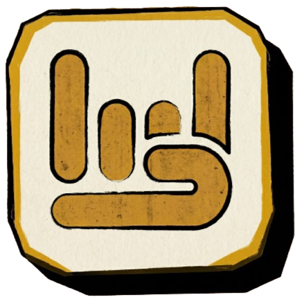

<p align="center">
  
</p>

<h1 align="center">Hands On!</h1>

<p align="center">
  <strong>A real-time multiplayer BISINDO (Indonesian Sign Language) learning game powered by hand gesture recognition and machine learning.</strong>
</p>

<p align="center">
  
  
  
  
  
  
</p>

<p align="center">
  <a href="https://handsson.netlify.app/"></a>
  <a href="https://github.com/YeeIsRizka/handsson-web"></a>
</p>

---

## 📖 About

**Hands On!** is a web-based educational game that teaches players the BISINDO (Bahasa Isyarat Indonesia) alphabet through interactive, real-time hand gesture recognition. Players spell out Indonesian words by performing sign language gestures in front of their webcam, with a TensorFlow.js model classifying 26 alphabet signs from hand landmark data extracted by MediaPipe Hands.

The game supports **real-time multiplayer** via PlayroomKit, allowing players to create or join rooms and compete in various game modes together.

> **Note:** This project was developed as part of a thesis (skripsi) research.

---

## ✨ Features

### 🎮 Game Modes

| Mode | Description |
|------|-------------|
| **🏋️ Training** | Practice spelling BISINDO signs at your own pace with no time pressure. Perfect for beginners. |
| **🏁 Race** | Compete to spell the most words within a time limit. Supports bot opponents for solo play. |
| **💀 Survival** | Spell words before your time runs out — each correct word adds time. Last player standing wins. |
| **⚔️ Battle** | Round-based PvP combat. Spell faster to deal more damage. Reduce your opponent's HP to zero to win. |

### 🤖 AI & Computer Vision

- **Real-time hand tracking** using [MediaPipe Hands](https://google.github.io/mediapipe/solutions/hands.html) (21 landmarks × 3 axes × 2 hands = 126 input features)
- **BISINDO alphabet classification** (26 classes, A–Z) via a TensorFlow.js neural network (Dense 128 → 64 → 26 with ReLU + Softmax)
- **Client-side inference** — no server required for gesture recognition; the model runs entirely in the browser

### 🌐 Multiplayer

- Create or join rooms with room codes
- Invite players via shareable links
- Bot opponents with configurable names
- Host controls (kick players, disband room, select game mode)
- Real-time state synchronization via [PlayroomKit](https://joinplayroom.com/)

### 🎨 Design

- **Neo-brutalist UI** with bold borders, vibrant colors, and heavy shadows
- Custom design system built on Tailwind CSS v4 with `Space Grotesk` typography
- Visual sign language hint cards (A–Z) shown during gameplay
- Splash screen, smooth animations, and responsive layout for mobile & desktop

---

## 🛠️ Tech Stack

| Layer | Technology |
|-------|------------|
| **Framework** | React 19 with Vite 6 |
| **Styling** | Tailwind CSS v4 (via `@tailwindcss/vite`) |
| **Gesture Detection** | MediaPipe Hands (CDN) |
| **ML Inference** | TensorFlow.js 4.22 (Graph Model) |
| **Multiplayer** | PlayroomKit |
| **Routing** | React Router DOM v7 |
| **Icons** | Heroicons v2 |

---

## 📁 Project Structure

```
handson/
├── public/
│   ├── assets/
│   │   ├── hints/          # Sign language hint images (A.png – Z.png)
│   │   └── logo/           # App logo
│   ├── model/              # TensorFlow.js model (model.json + weights)
│   └── sounds/             # Background music
├── src/
│   ├── app/                # App root, router, and providers
│   ├── features/
│   │   ├── battle/         # Battle mode (PvP, HP system, round results)
│   │   ├── gameplay/       # Shared gameplay components & hooks
│   │   │   ├── components/ # MainGameplay, WordDisplay, HintPanel, TimerBar, etc.
│   │   │   ├── constants/  # Game state enums
│   │   │   ├── hooks/      # useSpelling, useReadyCheck
│   │   │   └── utils/      # Word list & randomization
│   │   ├── gesture/        # Hand gesture detection & status display
│   │   ├── lobby/          # Room lobby UI (join, profile setup, player cards)
│   │   ├── race/           # Race mode (score-based competition)
│   │   ├── survival/       # Survival mode (time-based elimination)
│   │   └── training/       # Training mode (free practice)
│   ├── pages/              # Page-level route components
│   └── shared/
│       ├── components/     # Reusable UI primitives (Button, Card, Modal, etc.)
│       ├── constants/      # Route definitions
│       ├── context/        # React contexts (Audio, Loading, Settings)
│       ├── hooks/          # Shared hooks (usePreventReload, useHostDisband)
│       └── styles/         # Global CSS & design tokens
├── index.html
├── vite.config.js
└── package.json
```

---

## 🚀 Getting Started

### Prerequisites

- **Node.js** ≥ 18
- **npm** ≥ 9
- A device with a **webcam** (required for hand gesture detection)
- A modern browser with **WebGL** support (Chrome, Edge, or Firefox recommended)

### Installation

```bash
# Clone the repository
git clone https://github.com/YeeIsRizka/handsson-web.git
cd handsson-web

# Install dependencies
npm install
```

### Development

```bash
# Start the development server
npm run dev
```

The app will be available at `http://localhost:5173` (default Vite port).

> **Tip:** The dev server is configured with `host: true`, allowing access from other devices on your local network for multiplayer testing.

### Build for Production

```bash
# Create an optimized production build
npm run build

# Preview the production build locally
npm run preview
```

---

## 🎯 How to Play

1. **Open the app** in your browser and allow camera access.
2. **Create a Room** or **Join a Room** using a room code.
3. **Set up your profile** (name, color, photo).
4. **Choose a game mode** from the lobby (host only).
5. **Start the game** — a word will appear on screen, and you need to spell it out letter by letter using BISINDO hand signs.
6. **Follow the hint images** to form the correct hand gestures in front of your webcam.
7. The AI model detects and classifies your hand signs in real-time. Once a letter is recognized with sufficient confidence, it advances to the next letter.

---

## 🧠 ML Model Details

The gesture classification model is a fully-connected neural network trained to recognize 26 BISINDO alphabet signs:

| Property | Value |
|----------|-------|
| **Input** | 126 features (21 landmarks × 3 axes × 2 hands) |
| **Architecture** | Dense(128, ReLU) → Dense(64, ReLU) → Dense(26, Softmax) |
| **Output** | 26-class probability distribution (A–Z) |
| **Format** | TensorFlow.js Graph Model |
| **Inference** | Client-side, real-time via WebGL backend |

Hand landmarks are extracted using MediaPipe Hands, normalized/scaled, and fed into the model for classification.

---

## 📜 Available Scripts

| Command | Description |
|---------|-------------|
| `npm run dev` | Start development server with hot reload |
| `npm run build` | Build production bundle |
| `npm run preview` | Preview production build locally |
| `npm run lint` | Run ESLint code quality checks |

---

## 🤝 Contributing

Contributions are welcome! If you'd like to contribute:

1. Fork the repository
2. Create a feature branch (`git checkout -b feature/amazing-feature`)
3. Commit your changes (`git commit -m 'Add amazing feature'`)
4. Push to the branch (`git push origin feature/amazing-feature`)
5. Open a Pull Request

---

## 📄 License

This project is licensed under the **MIT License** — see the [LICENSE](LICENSE) file for details.

---

<p align="center">
  Made with ❤️ for BISINDO education
</p>
